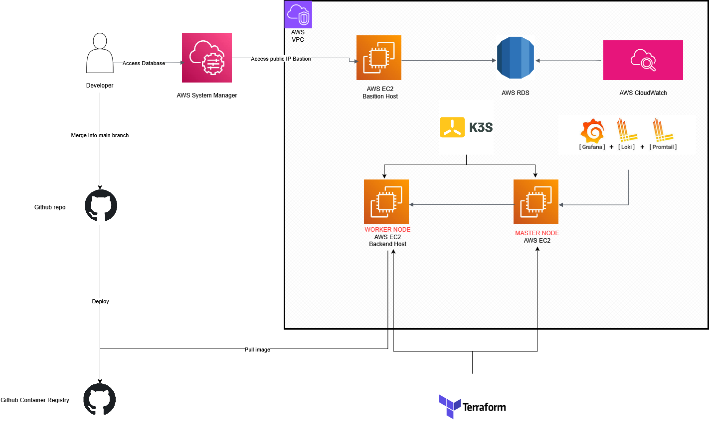

<div id="top"></div>

<h1 align="center">Node.js Express REST API MySQL JS Example</h1>

<div align="center">
  <p align="center">
    This is a fork project which was used to do CI/CD things. 
  </p>
  <a href="https://www.postman.com/workspace/node-js-express-mysql-rest-api-example/overview">View Postman Files</a>
</div>

<!-- TABLE OF CONTENTS -->
<details>
  <summary>Table of Contents</summary>
  <ol>
    <li><a href="#cicd-pipeline">CI/CD Pipeline</a></li>
    <li>
      <a href="#about-the-application">About The Application</a>
      <ul>
        <li><a href="#built-with">Built With</a></li>
      </ul>
    </li>
    <li><a href="#how-to-install">How To Install</a></li>
    <li><a href="#available-scripts">Available Scripts</a></li>
    <li><a href="#postman">Postman</a></li>

  </ol>
</details>


<!-- CI/CD PIPELINE -->

## CI/CD Pipeline

This project implements a complete CI/CD pipeline using GitHub Actions for automated building, testing, and deployment to Kubernetes on AWS.

### Deployment Flow



You can also view my demo in [here](https://youtu.be/DoywMq1oUcY)
### Architecture Overview

The CI/CD pipeline follows this workflow:

1. **Developer** merge code to GitHub repository (`main`)
2. **GitHub Actions** automatically triggers the build pipeline
3. **Docker Image** is built and pushed to GitHub Container Registry (GHCR)
4. **K3S Cluster** on AWS pulls the image and deploys to worker nodes
5. **CloudWatch** monitors AWS RDS
6. **Loki, Promtail, and Grafana** watch log from my nodejs-app
7. **AWS RDS MySQL** provides persistent database storage

### GitHub Actions Workflow

The automated pipeline is configured in `.github/workflows/deploy-ghcr.yml` and performs:


**Build Steps:**

1. **Checkout Repository** - Retrieves the latest code
2. **Create Environment File** - Configures database secrets from GitHub Secrets:
   - `DB_HOST` - MySQL database hostname
   - `DB_PORT` - MySQL database port
   - `DB_USERNAME` - Database user
   - `DB_USERNAME_PASSWORD` - Database password
   - `DB_NAME` - Database name

3. **Docker Setup & Authentication**
   - Sets up Docker Buildx for multi-platform builds
   - Authenticates with GitHub Container Registry (GHCR)


4. **Build & Push** - Builds Docker image and pushes to GHCR:

### Docker Image

The application is containerized using the `Dockerfile` with:
- **Base Image:** `node:18-alpine` (lightweight Node.js environment)
- **Port:** 3000 (exposed for application traffic)
- **CMD:** `npm start` (runs application in production mode)

### Kubernetes Deployment

The application is deployed to K3S cluster on AWS EC2 with:

**Master Node Configuration:**
- AWS EC2 instance running K3S master
- Hosts control plane components

**Worker Nodes:**
- AWS EC2 instances running K3S worker nodes
- Deployment configuration in `pods-k3s/worker-deployment/app-deployment.yaml`
- Uses `imagePullPolicy: Always` to fetch latest image on each deployment

**Deployment Manifest:**
- Pulls image from GHCR: `ghcr.io/binh1232004/node-express-rest-api-mysql-js-example:main`
- Container port: 3000
- Replica count: 1 (configurable)
- Node selector for specific worker node placement

### Database

- **AWS RDS MySQL** instance provides persistent storage
- Connection details passed via environment variables
- Initialized with schema from `sql/init-db.sql`

### Monitoring & Logging

The infrastructure includes comprehensive observability:

- **Grafana** - Metrics and log visualization dashboard
- **Loki** - Centralized log aggregation
- **Promtail** - Log shipper collecting container logs
- **AWS CloudWatch** - watch latency database

These components run as DaemonSets and deployments in the K3S cluster, collecting logs from all worker nodes.

### AWS Infrastructure as Code

Infrastructure is defined in `terraform-aws-infrastructure/` with:
- EC2 instances for K3S master and worker nodes
- VPC and security group configurations

To deploy AWS infrastructure:
```bash
cd terraform-aws-infrastructure
terraform init
terraform plan
terraform apply
```

### Environment Setup for CI/CD

Set up the following GitHub Secrets in your repository settings:

| Secret Name | Description |
|---|---|
| `DB_HOST` | AWS RDS MySQL hostname |
| `DB_PORT` | MySQL port (default: 3306) |
| `DB_USERNAME` | Database username |
| `DB_USERNAME_PASSWORD` | Database password |
| `DB_NAME` | Database name |

<p align="right">(<a href="#top">back to top</a>)</p>
<!-- ABOUT THE APPLICATION -->


## About The Application

This REST API example is a basic backend application to test basic API functions with MySQL database.

It is built with Node.js and Express Framework with Javascript. In addition, the applications database is MySQL, with the use of mysql2 library.

In the applicaiton we can manage user data, such as create/edit/delete a user. In addition, we can get all the users in the database.

The point of this backend application is to test CRUD operations with MySQL database.

<p align="right">(<a href="#top">back to top</a>)</p>

### Built With

-   [Node.js](https://nodejs.org/en/)
-   [Express](https://expressjs.com/)
-   [Cors](https://www.npmjs.com/package/cors)
-   [MySQL2](https://www.npmjs.com/package/mysql2)

<p align="right">(<a href="#top">back to top</a>)</p>

<!-- INSTALLATION INSTRUCTIONS -->

## How To Install

**Git clone**

```
git clone https://github.com/almoggutin/Node-Express-REST-API-MySQL-JS-Example
```

**Instructions**

-   After cloning the the repository run `npm i` in order to install all the dependencies.
-   Create an env file in the root of the project named .env and fill in the follwing variables: PORT, DB_HOST, DB_PORT, DB_USERNAME, DB_USERNAME_PASSWORD, DB_NAME.
-   In the sql directory, there are sql files that you will need to execute in order to initialize the database.

<p align="right">(<a href="#top">back to top</a>)</p>

<!--  AVAILABLE SCRIPTS -->

## Available Scripts

In the project directory, you can run:

### `npm start`

Runs the app in the production mode.\
However, this script is only meant to be run when deploying the application. The application is built, where you need to setup the env variables on the machine that you will be hosting it on or on a web hosting service, unlike in development mode.

### `npm run dev`

Runs the app in the development mode.\
Open localhost on the port you decided on in the env variables to view it in the browser.

The API will reload if you make edits with the use of nodemon.

<p align="right">(<a href="#top">back to top</a>)</p>

<!-- POSTMAN -->

## Postman

If you would like to run the files locally on your machine in the postman desktop application, included in the repository, in the `postman` directory all the files so you can import them. In addition you will have to configure env variables in postman so that you will be able to test properly everything.

<div align="center">
  
  
</div>

<p align="right">(<a href="#top">back to top</a>)</p>

